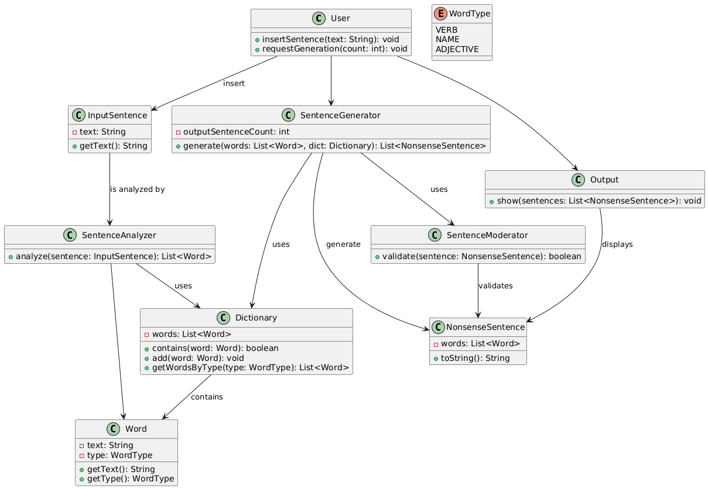
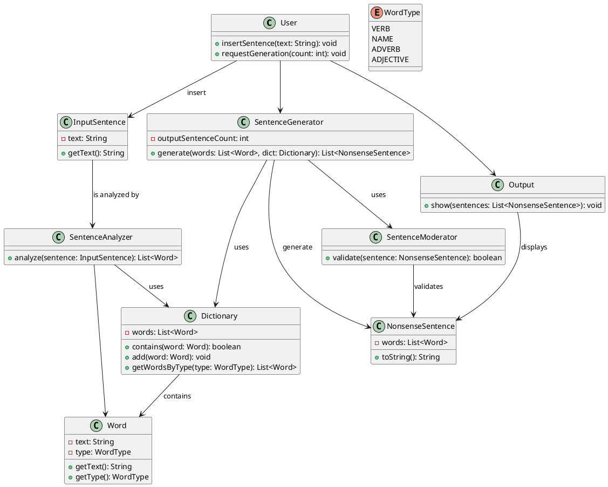

# Class Diagram

```plantuml
@startuml
class User {
  + insertSentence(text: String): void
  + requestGeneration(count: int): void
}

class InputSentence {
  - text: String
  + getText(): String
}

class Word {
  - text: String
  - type: WordType
  + getText(): String
  + getType(): WordType
}

enum WordType {
  VERB
  NAME
  ADVERB
  ADJECTIVE
}

class Dictionary {
  - words: List<Word>
  + contains(word: Word): boolean
  + add(word: Word): void
  + getWordsByType(type: WordType): List<Word>
}

class SentenceAnalyzer {
  + analyze(sentence: InputSentence): List<Word>
}

class SentenceGenerator {
  - outputSentenceCount: int
  + generate(words: List<Word>, dict: Dictionary): List<NonsenseSentence>
}

class NonsenseSentence {
  - words: List<Word>
  + toString(): String
}

class SentenceModerator {
  + validate(sentence: NonsenseSentence): boolean
}

class Output {
  + show(sentences: List<NonsenseSentence>): void
}

User --> InputSentence : insert
User --> SentenceGenerator 
InputSentence --> SentenceAnalyzer : is analyzed by
SentenceAnalyzer --> Word
SentenceAnalyzer --> Dictionary : uses
Dictionary --> Word : contains
SentenceGenerator --> Dictionary : uses
SentenceGenerator --> NonsenseSentence : generate
SentenceGenerator --> SentenceModerator : uses 
SentenceModerator --> NonsenseSentence : validates
User --> Output 
Output --> NonsenseSentence : displays
@enduml
```
