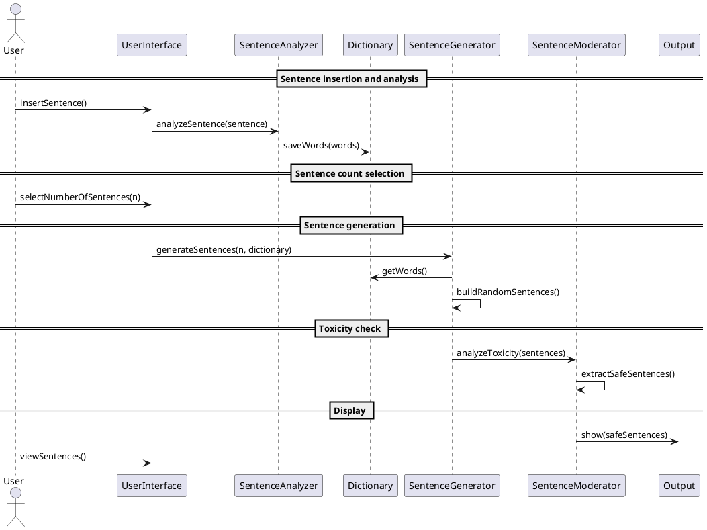
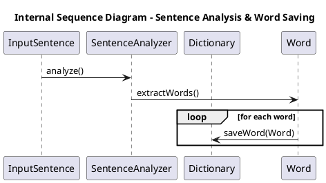
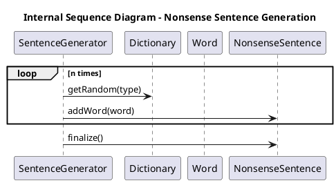
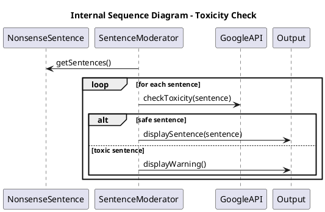
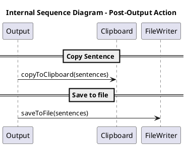

# System Sequence Diagram

```plantuml
@startuml
actor User
participant "UserInterface" as UI
participant "SentenceAnalyzer" as SA
participant "Dictionary" as D
participant "SentenceGenerator" as SG
participant "SentenceModerator" as SM
participant "Output" as O

== Sentence insertion and analysis ==
User -> UI : insertSentence()
UI -> SA : analyzeSentence(sentence)
SA -> D : saveWords(words)

== Sentence count selection ==
User -> UI : selectNumberOfSentences(n)

== Sentence generation ==
UI -> SG : generateSentences(n, dictionary)
SG -> D : getWords()
SG -> SG : buildRandomSentences()

== Toxicity check ==
SG -> SM : analyzeToxicity(sentences)
SM -> SM : extractSafeSentences()

== Display ==
SM -> O : show(safeSentences)
User -> UI : viewSentences()
@enduml
```

# Internal Sequence Diagrams

## Sentence Analysis & Word Saving

```plantuml
@startuml
title Internal Sequence Diagram – Sentence Analysis & Word Saving

participant InputSentence
participant SentenceAnalyzer
participant Dictionary
participant Word

InputSentence -> SentenceAnalyzer : analyze()
SentenceAnalyzer -> Word : extractWords()
loop for each word 
  Word -> Dictionary : saveWord(Word)
end
@enduml
```

## Nonsense Sentence Generation

```plantuml
@startuml
title Internal Sequence Diagram – Nonsense Sentence Generation

participant SentenceGenerator
participant Dictionary
participant Word
participant NonsenseSentence

loop n times
  SentenceGenerator -> Dictionary : getRandom(type)
  SentenceGenerator -> NonsenseSentence : addWord(word)
end
SentenceGenerator -> NonsenseSentence : finalize()
@enduml
```

## Toxicity Check

```plantuml
@startuml
title Internal Sequence Diagram – Toxicity Check

participant NonsenseSentence
participant SentenceModerator
participant GoogleAPI
participant Output

SentenceModerator -> NonsenseSentence : getSentences()
loop for each sentence
  SentenceModerator -> GoogleAPI : checkToxicity(sentence)
  alt safe sentence
    SentenceModerator -> Output : displaySentence(sentence)
  else toxic sentence
    SentenceModerator -> Output : displayWarning()
  end
end
@enduml
```

## Post-Output action : copy and save

```plantuml
@startuml
title Internal Sequence Diagram – Post-Output Action

participant Output
participant Clipboard
participant FileWriter

== Copy Sentence ==
Output -> Clipboard : copyToClipboard(sentences)

== Save to file ==
Output -> FileWriter : saveToFile(sentences)
@enduml
```
