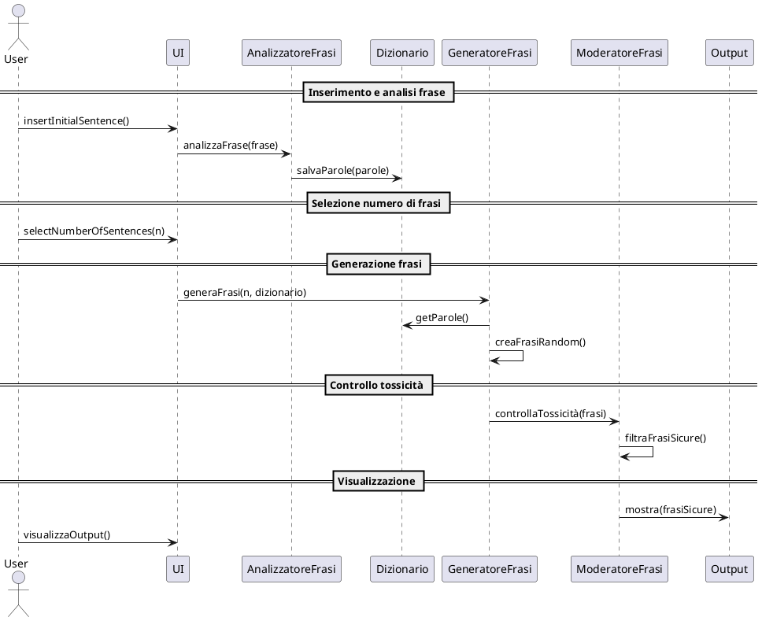
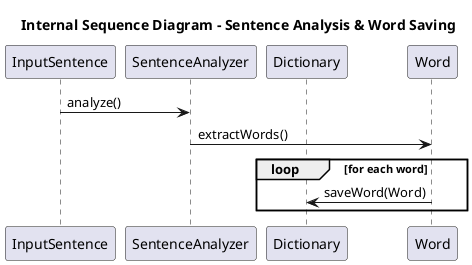
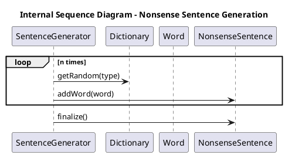
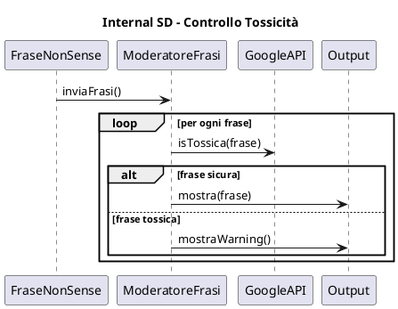
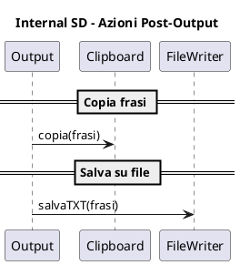

# System Sequence Diagram

```plantuml
@startuml
actor User
participant UI
participant "AnalizzatoreFrasi" as AF
participant "Dizionario" as D
participant "GeneratoreFrasi" as GF
participant "ModeratoreFrasi" as MF
participant "Output" as O

== Inserimento e analisi frase ==
User -> UI : insertInitialSentence()
UI -> AF : analizzaFrase(frase)
AF -> D : salvaParole(parole)

== Selezione numero di frasi ==
User -> UI : selectNumberOfSentences(n)

== Generazione frasi ==
UI -> GF : generaFrasi(n, dizionario)
GF -> D : getParole()
GF -> GF : creaFrasiRandom()

== Controllo tossicità ==
GF -> MF : controllaTossicità(frasi)
MF -> MF : filtraFrasiSicure()

== Visualizzazione ==
MF -> O : mostra(frasiSicure)
User -> UI : visualizzaOutput()
@enduml
```

# Internal Sequence Diagrams

## Analisi frasi e salvataggio

```plantuml
@startuml
title Internal Sequence Diagram – Sentence Analysis & Word Saving

participant InputSentence
participant SentenceAnalyzer
participant Dictionary
participant Word

InputSentence -> SentenceAnalyzer : analyze()
SentenceAnalyzer -> Word : extractWords()
loop for each word 
  Word -> Dictionary : saveWord(Word)
end
@enduml
```

## Generazione di frasi nonsense

```plantuml
@startuml
title Internal Sequence Diagram – Nonsense Sentence Generation

participant SentenceGenerator
participant Dictionary
participant Word
participant NonsenseSentence

loop n times
  SentenceGenerator -> Dictionary : getRandom(type)
  SentenceGenerator -> NonsenseSentence : addWord(word)
end
SentenceGenerator -> NonsenseSentence : finalize()
@enduml
```

## Controllo tossicità

```plantuml
@startuml
title Internal SD – Controllo Tossicità

participant FraseNonSense
participant ModeratoreFrasi
participant GoogleAPI
participant Output

FraseNonSense -> ModeratoreFrasi : inviaFrasi()
loop per ogni frase
  ModeratoreFrasi -> GoogleAPI : isTossica(frase)
  alt frase sicura
    ModeratoreFrasi -> Output : mostra(frase)
  else frase tossica
    ModeratoreFrasi -> Output : mostraWarning()
  end
end
@enduml
```

## Azioni post-output: copia, salvataggio

```plantuml
@startuml
title Internal SD – Azioni Post-Output

participant Output
participant Clipboard
participant FileWriter

== Copia frasi ==
Output -> Clipboard : copia(frasi)

== Salva su file ==
Output -> FileWriter : salvaTXT(frasi)
@enduml
```
