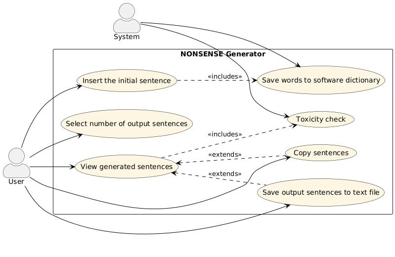
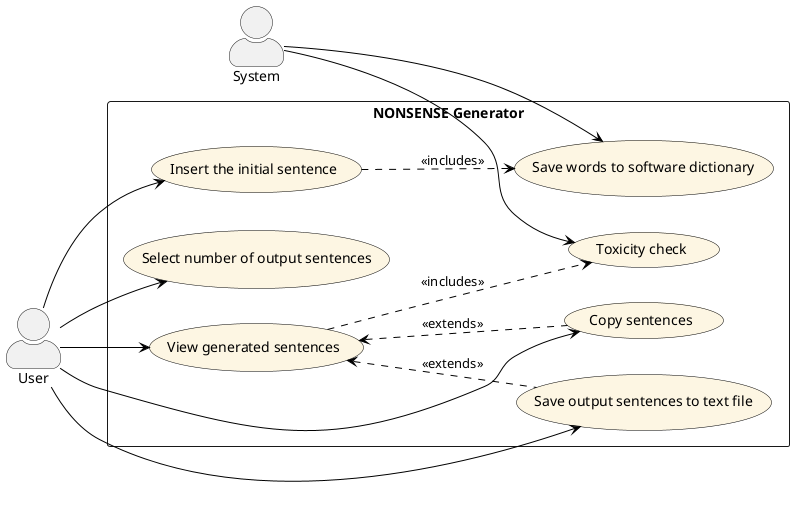

# Use Cases
1. Inserimento frase iniziale
2. Scelta del numero di frasi in output
3. Vedere risultati delle frasi generate
4. Controllo tossicità
5. Copia frasi
6. Salvataggio frase nel file di testo
7. Salvataggio parole nel dizionario del software

<!--TABELLA UC1-->
            <table>
                <tr>
                    <th><b id="UC1">Use Case 1</b></th>
                </tr>
                <tr>
                    <td><b>Nome Use Case</b></td>
                    <td>Inserire la frase iniziale</td>
                </tr>
                <tr>
                    <td><b>Attori</b></td>
                    <td>Utente</td>
                </tr>
                <tr>
                    <td><b>Descrizione</b></td>
                    <td>Immissione di una frase che verrà analizzata sintatticamente dal sistema.</td>
                </tr>
                <tr>
                    <td><b>Precondizioni</b></td>
                    <td>-</td>
                </tr>
                <tr>
                    <td><b>Scenario principale</b></td>
                    <td>L'utente inserisce una frase nella casella di testo.</td>
                </tr>
                <tr>
                    <td><b>Scenario alternativo</b></td>
                    <td>-</td>
                </tr>
                <tr>
                    <td><b>Post condizioni</b></td>
                    <td>La frase viene analizzata.</td>
                </tr>
                <tr>
                    <td><b>Note</b></td>
                    <td>-</td>
                </tr>
            </table>

              <!--TABELLA UC2-->
            <table>
                <tr>
                    <th><b id="UC2">Use Case 2</b></th>
                </tr>
                <tr>
                    <td><b>Nome Use Case</b>
                    <td>Selezione del numero di frasi in output</td>
                </tr>
                <tr>
                    <td><b>Attori</b></td>
                    <td>Utente</td>
                </tr>
                <tr>
                    <td><b>Descrizione</b></td>
                    <td>L'utente seleziona la quantità desiderata di frasi nonsense da produrre.</td>
                </tr>
                <tr>
                    <td><b>Precondizioni</b></td>
                    <td>-</td>
                </tr>
                <tr>
                    <td><b>Scenario principale</b></td>
                    <td>L'utente seleziona il numero di frasi senza senso.</td>
                </tr>
                <tr>
                    <td><b>Scenario alternativo</b></td>
                    <td>Non viene inserita alcuna frase, quindi non viene generato nulla.</td>
                </tr>
                <tr>
                    <td><b>Post condizioni</b></td>
                    <td>Il software genera il numero di frasi nonsense richiesto.</td>
                </tr>
                <tr>
                    <td><b>Note</b></td>
                    <td>-</td>
                </tr>
            </table>

             <!--TABELLA UC3-->
            <table>
                <tr>
                    <th><b id="UC3">Use Case 3</b></th>
                </tr>
                <tr>
                    <td><b>Nome Use Case</b>
                    <td>Vedere le frasi generate</td>
                </tr>
                <tr>
                    <td><b>Attori</b></td>
                    <td>Utente</td>
                </tr>
                <tr>
                    <td><b>Descrizione</b></td>
                    <td>L'utente visualizza il numero di frasi senza senso generate come output.</td>
                </tr>
                <tr>
                    <td><b>Precondizioni</b></td>
                    <td>L'utente deve aver inserito una frase di input e selezionato il numero di frasi senza senso da generare.</td>
                </tr>
                <tr>
                    <td><b>Scenario principale</b></td>
                    <td>Dopo aver fatto clic sul pulsante "Genera", l'utente vede le frasi senza senso generate visualizzate come output.</td>
                </tr>
                <tr>
                    <td><b>Scenario alternativo</b></td>
                    <td>L'utente non ha inserito né la frase di input né il numero di frasi di output desiderate, perciò nessuna frase verrà generata e visualizzata.</td>
                </tr>
                <tr>
                    <td><b>Post condizioni</b></td>
                    <td>-</td>
                </tr>
                <tr>
                    <td><b>Note</b></td>
                    <td>-</td>
                </tr>
            </table>

             <!--TABELLA UC4-->
            <table>
                <tr>
                    <th><b id="UC4">Use Case 4</b></th>
                </tr>
                <tr>
                    <td><b>Nome Use Case</b>
                    <td>Controllo tossicità</td>
                </tr>
                <tr>
                    <td><b>Attori</b></td>
                    <td>Software</td>
                </tr>
                <tr>
                    <td><b>Descrizione</b></td>
                    <td>Il sistema controlla che ciascuna delle frasi generate non includa contenuti appropriati.</td>
                </tr>
                <tr>
                    <td><b>Precondizioni</b></td>
                    <td>Tutte le frasi richieste in output sono state generate.</td>
                </tr>
                <tr>
                    <td><b>Scenario principale</b></td>
                    <td>La frase è sicura, quindi viene mostrata nell'output.</td>
                </tr>
                <tr>
                    <td><b>Scenario alternativo</b></td>
                    <td>La frase è tossica, quindi viene visualizzato un messaggio di avviso invece della frase.</td>
                </tr>
                <tr>
                    <td><b>Post condizioni</b></td>
                    <td>-</td>
                </tr>
                <tr>
                    <td><b>Note</b></td>
                    <td>Viene utilizzato l' API di Google per controllare ciascuna frase in output.</td>
                </tr>
            </table>

            <!--TABELLA UC5-->
            <table>
                <tr>
                    <th><b id="UC5">Use Case 5</b></th>
                </tr>
                <tr>
                    <td><b>Nome Use Case</b>
                    <td>Copia frasi</td>
                </tr>
                <tr>
                    <td><b>Actors</b></td>
                    <td>Utente</td>
                </tr>
                <tr>
                    <td><b>Descrizione</b></td>
                    <td>Quando l'utente fa clic sul pulsante "Copia", tutte le frasi nonsense generate in precedenza vengono rimosse.</td>
                </tr>
                <tr>
                    <td><b>Precondizioni</b></td>
                    <td>L'utente ha selezionato quali frasi desidera copiare.</td>
                </tr>
                <tr>
                    <td><b>Scenario principale</b></td>
                    <td>L'utente può copiare una frase specifica o tutte le frasi generate.</td>
                </tr>
                <tr>
                    <td><b>Scenario alternativo</b></td>
                    <td>-</td>
                </tr>
                <tr>
                    <td><b>Post condizioni</b></td>
                    <td>-</td>
                </tr>
                <tr>
                    <td><b>Note</b></td>
                    <td>-</td>
                </tr>
            </table>

            <!--TABELLA UC6-->
            <table>
                <tr>
                    <th><b id="UC6">Use Case 6</b></th>
                </tr>
                <tr>
                    <td><b>Nome Use Case</b>
                    <td>Salva frasi nonsense nel file di testo</td>
                </tr>
                <tr>
                    <td><b>Attori</b></td>
                    <td>Utente</td>
                </tr>
                <tr>
                    <td><b>Descrizione</b></td>
                    <td>Le parole della frase inserita dall'utente vengono salvate nel dizionario interno del software.</td>
                </tr>
                <tr>
                    <td><b>Precondizioni</b></td>
                    <td>L'utente ha inserito una frase di input, ha selezionato il numero di frasi di output e ha fatto clic sul pulsante "Genera".</td>
                </tr>
                <tr>
                    <td><b>Scenario principale</b></td>
                    <td>L'utente ha inserito la frase. Le parole estratte vengono salvate nel dizionario del software per un utilizzo futuro nella generazione di frasi senza senso.</td>
                </tr>
                <tr>
                    <td><b>Scenario alternativo</b></td>
                    <td>-</td>
                </tr>
                <tr>
                    <td><b>Post condizioni</b></td>
                    <td>-</td>
                </tr>
                <tr>
                    <td><b>Note</b></td>
                    <td>Le frasi nonsense sono salvate in un file .txt</td>
                </tr>
            </table>

            <!--TABELLA UC7-->
            <table>
                <tr>
                    <th><b id="UC7">Use Case 7</b></th>
                </tr>
                <tr>
                    <td><b>Nome Use Case</b>
                    <td>Salva parole nel dizionario</td>
                </tr>
                <tr>
                    <td><b>Attori</b></td>
                    <td>Software</td>
                </tr>
                <tr>
                    <td><b>Descrizione</b></td>
                    <td>Salvataggio automatico delle parole dalla frase inserita dall'utente nel dizionario interno del software.</td>
                </tr>
                <tr>
                    <td><b>Precondizioni</b></td>
                    <td>L'utente ha inserito una frase.</td>
                </tr>
                <tr>
                    <td><b>Scenario principale</b></td>
                    <td>Le parole estratte vengono salvate nel dizionario interno in modo da poter essere riutilizzate nella generazione di frasi senza senso.</td>
                </tr>
                <tr>
                    <td><b>Scenario alternativo</b></td>
                    <td>-</td>
                </tr>
                <tr>
                    <td><b>Post condizioni</b></td>
                    <td>Persistenza dei dati: le parole salvate devono rimanere disponibili anche dopo la chiusura del programma.</td>
                </tr>
                <tr>
                    <td><b>Note</b></td>
                    <td>Le parole salvate vengono utilizzate attivamente nelle generazioni future.</td>
                </tr>
            </table>

# Grafo Use Cases

